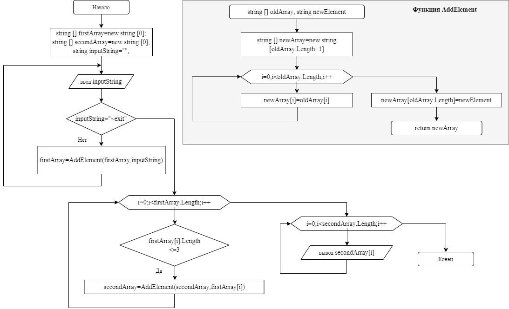

# Итоговая контрольная работа по блоку 1 #
### ФИО обучающегося: 
Богомолов Александр Евгеньевич
### Задание:
    Написать программу, которая из имеющегося массива строк формирует массив из строк, длина которых меньше либо равна 3 символов.
    Первоначальный массив можно ввести с клавиатуры, либо задать на старте выполнения агоритма. При решении не рекомендуется
    пользоваться коллекциями, лучше обойтись исключительно массивами.
### Описание решения:
Пользователь вводит в терминал строки, которые записываются в массив **firstArray**. Ввод продолжается до тех пор, пока в терминал не будет введено ключевое слово: "*~exit*". После окончания ввода будет выполняться программынй алгоритм и на экран выведется новый массив **secondArray**, сформированный из элементов массива **firstArray** длина которых меньше либо равна трем символам. Блок схема алгоритма программы приведена на рисунке:
 